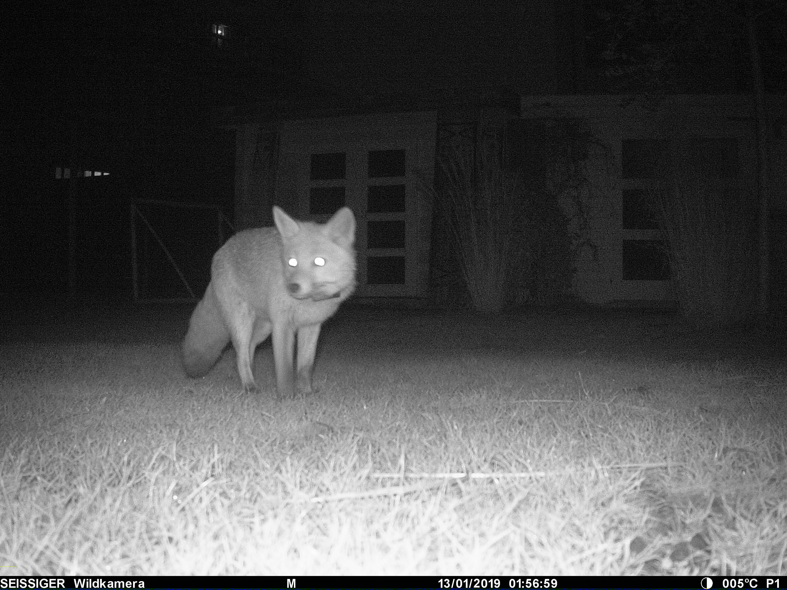
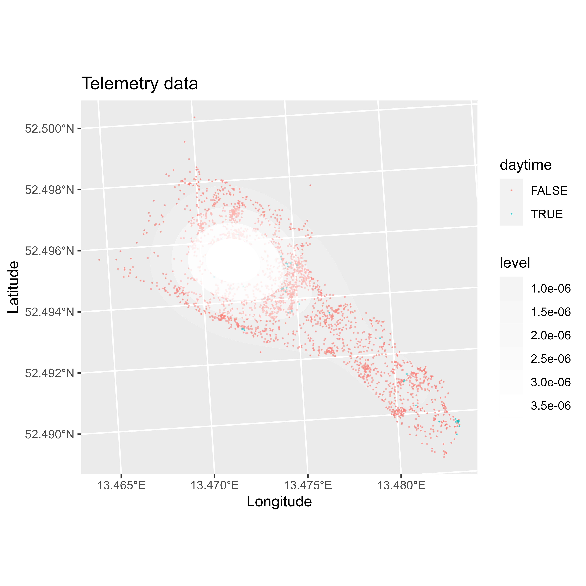
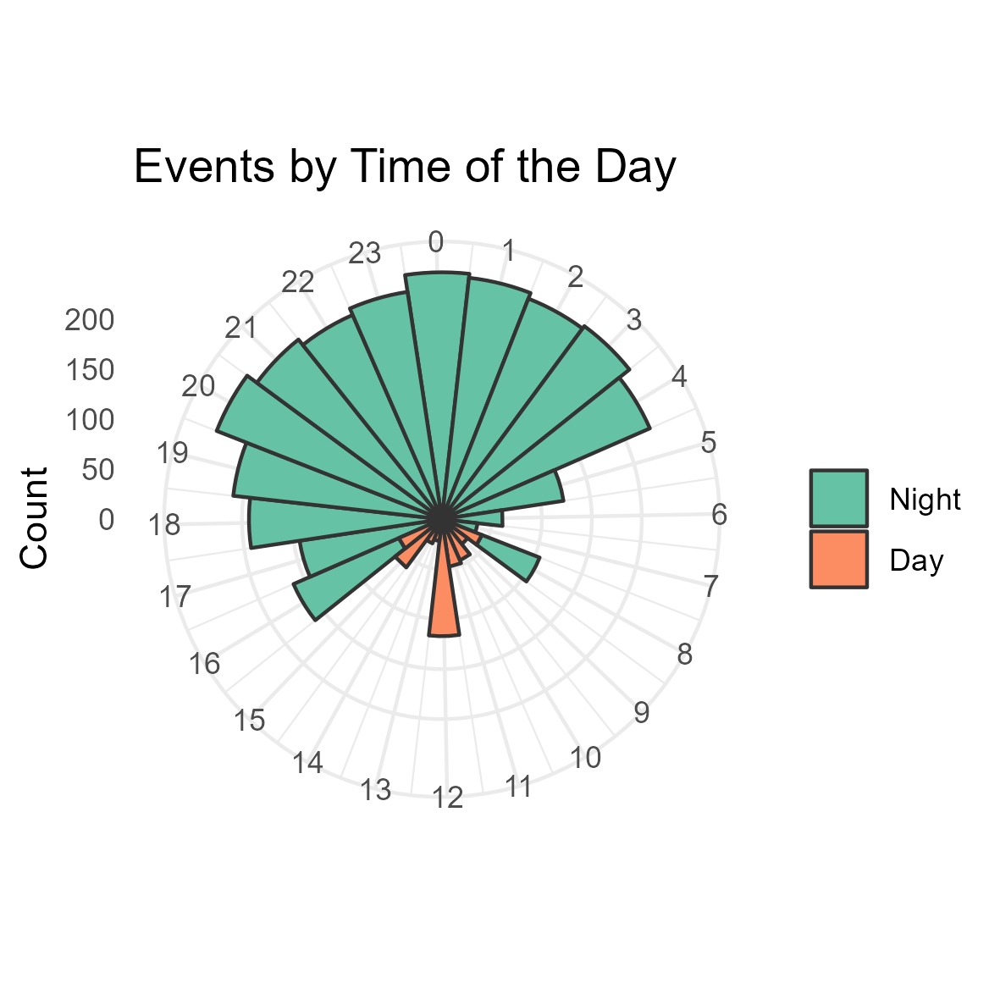

# Course4_MoveQ
 Introduction to movement data analysis. Follow 'Q von Stralau' here: [Intro to working with telemetry data](https://stephkramer.github.io/Course4_MoveQ.html)....  
 As a 'learning control exercise', please solve Exercise 1 in course 4 material yourself (C4_E1).
   
More exercises here:
* Course 4 Exercise 2: [C4_E2](https://stephkramer.github.io/Course4_MoveQ_Exercise2.html)
  
 

